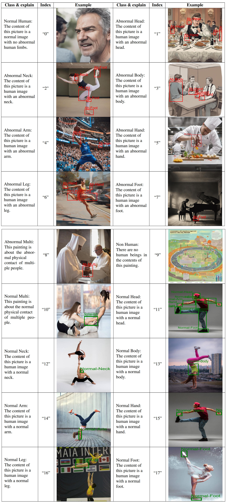

# HumanRefiner


## Introduction

Welcome to the official code repository for the [paper](https://arxiv.org/abs/2407.06937) "HumanRefiner: Benchmarking Abnormal Human Generation and Refining with Coarse-to-fine Pose-Reversible Guidance."

In this project, we introduce AbHuman, the first large-scale benchmark focused on anatomical anomalies. The benchmark consists of 56K synthesized human images, each annotated with 147K human anomalies in 18 different categories. Based on this, we developed HumanRefiner, a novel plug-and-play method for coarse-to-fine refinement of human anomalies.

## Data

Our data is available on 🤗 [Hugging Face](https://huggingface.co/datasets/Enderfga/HumanRefiner).

To download the dataset, use the following commands:

```bash
git lfs install
git clone https://huggingface.co/datasets/Enderfga/HumanRefiner
```

After cloning, extract the train and validation datasets:

```bash
tar -xzf train.zip
tar -xzf val.zip
```
## Annotation Examples
Below is a detailed illustration of class definitions with visualized examples from the AbHuman dataset:


## Cite

If you use our work in your research, please cite our paper:

```bibtex
@misc{fang2024humanrefinerbenchmarkingabnormalhuman,
      title={HumanRefiner: Benchmarking Abnormal Human Generation and Refining with Coarse-to-fine Pose-Reversible Guidance}, 
      author={Guian Fang and Wenbiao Yan and Yuanfan Guo and Jianhua Han and Zutao Jiang and Hang Xu and Shengcai Liao and Xiaodan Liang},
      year={2024},
      eprint={2407.06937},
      archivePrefix={arXiv},
      primaryClass={cs.CV},
      url={https://arxiv.org/abs/2407.06937}, 
}
```

## Contact

If you have any questions or suggestions, please contact us:

- Email: enderfga@gmail.com
- GitHub Issues: [HumanRefiner Issues](https://github.com/Enderfga/HumanRefiner/issues)

Thank you for your support!
